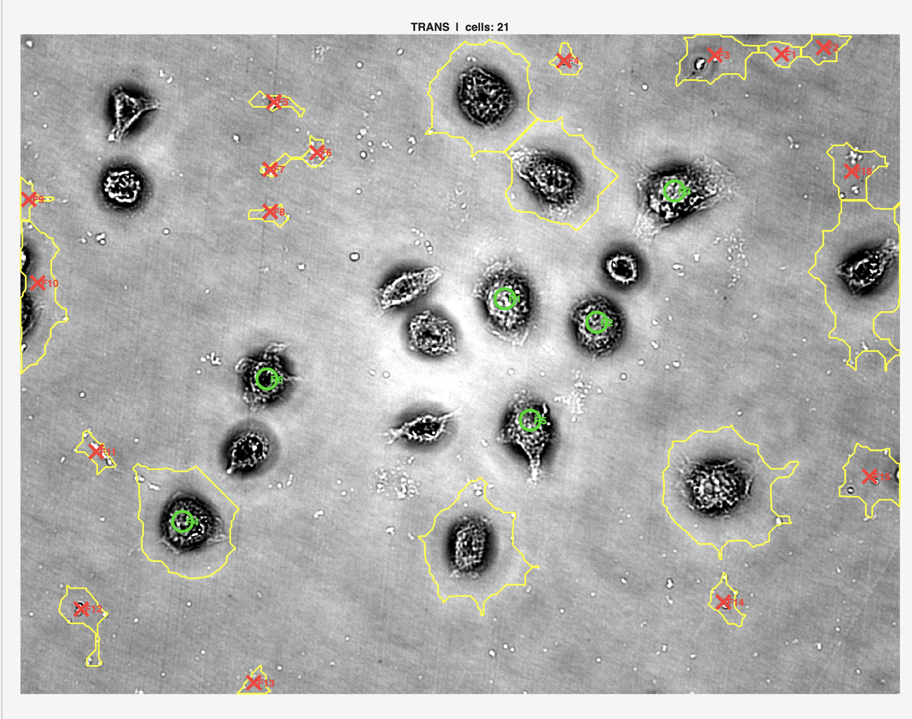
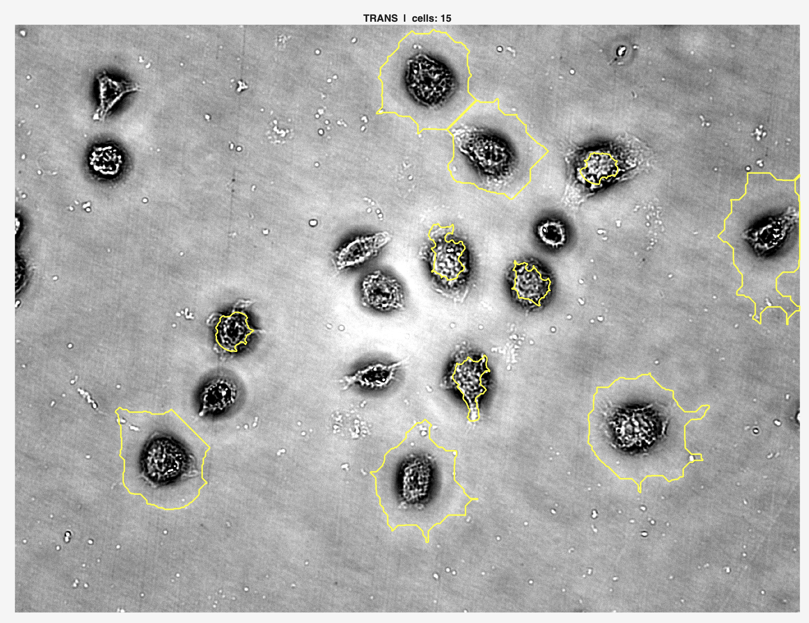
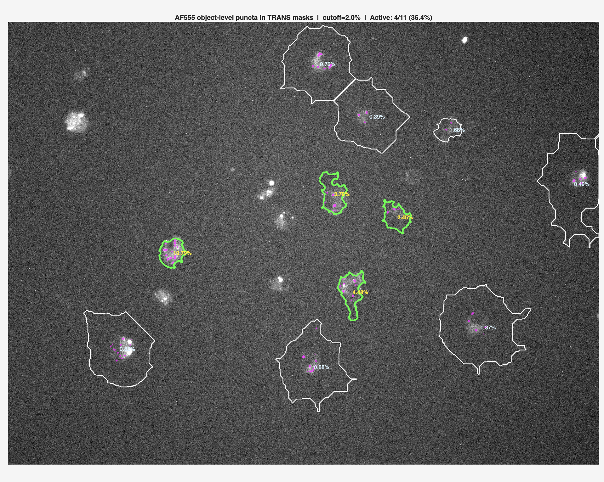

# Macrophage Phagocytosis UI User Manual

This guide explains how to run `macrophage_phagocytosis_ui_puncta_final.m` and use the interface to detect macrophage boundaries from the TRANS image, quantify AF555 puncta inside those boundaries, and save the final results.


## Requirements

- MATLAB
- Image Processing Toolbox
- A TRANS image and a matching AF555 image from the same field of view

The TRANS and AF555 images should have the same pixel dimensions and should already be aligned.

## Starting The Script

1. Open MATLAB.
2. Navigate to the folder containing the script:

   ```text
   /Users/adityamathur/Desktop/Macrophage Analysis
   ```

3. In the MATLAB Command Window, run:

   ```matlab
   results = macrophage_phagocytosis_ui_puncta_final;
   ```

4. When prompted to upload a file, upload  the **TRANS image** first.
5. After selecting the TRANS image, another prompt to upload a file will appear. Select the **AF555 image**.
6. If MATLAB asks whether to use saved parameters, choose either:
   - **Use defaults** for the built-in default settings.
   - **Load params .mat** if you previously saved custom parameters.

## Basic Workflow


### 1. Press Auto-detect

After importing the **TRANS image** and **AF555 image**, click:

```text
>> Auto-detect
```

This creates the initial macrophage boundaries from the TRANS image.

After auto-detection, the detected cell boundaries appear on the TRANS image.

### 2. Refine The Boundaries If Needed

If the initial boundaries are not satisfactory, use the manual guidance tools.

Use:

```text
+ REAL
```

Then click on cells that should be included but were missed or poorly handled. A REAL pick tells the detector, "this is a real macrophage-like region."

Use:

```text
x FAKE
```

Then click on regions that should not be counted as macrophages. A FAKE pick tells the detector, "this detected region is not a real macrophage."

Use:

```text
Undo pick
```

to remove the most recent manual pick.

Use:

```text
Clr picks
```

to clear all REAL and FAKE picks.

Important: after placing REAL or FAKE picks, press:

```text
>> Update detection
```

The picks do not change the final boundaries until you update the detection.

Example of REAL and FAKE picks being added:



### 3. Check The Boundaries

Before analysis, inspect the detected TRANS boundaries. This is important because puncta are quantified only inside accepted TRANS cell masks.

If a boundary is too large, the puncta fraction may be underestimated because the cell area denominator is too large.

If a boundary includes the wrong region, puncta may be assigned to that incorrect region.

The current script is designed to quantify puncta inside the boundaries it is given. It does not automatically know whether a TRANS boundary is biologically perfect.

Example after updating detection so the accepted boundaries look reasonable:



### 4. Set AF555 Background Region, If Needed (Optional)

Click:

```text
Set BG region
```

Then draw a rectangle over a clean background area with no cells and no puncta.

The script calculates the mean AF555 intensity inside that rectangle and subtracts it from the AF555 image before puncta scoring. This helps remove camera/background fluorescence.

If no background region is set, the script uses no manual background subtraction.

Choose a region that represents true background. Do not include cells, puncta, debris, or bright artifacts.

### 5. Run Analysis

Once the TRANS boundaries look acceptable, click:

```text
Analyse / Show Results
```

This runs AF555 object-level puncta detection inside the accepted TRANS cell boundaries and updates the result tabs.

If you have pending REAL or FAKE picks, the script may warn you to press **Update detection** first.

Example final AF555 puncta analysis:



## What Each Tab Means

### TRANS (All Cells)

This tab shows the TRANS image with the current detected macrophage boundaries.

Use this tab to check whether the script has found the correct macrophage cell boundaries before running analysis.

### TRANS B&W Preview

This tab shows the binary mask or feature-map preview used during TRANS detection.

Use this tab when tuning TRANS boundary detection parameters. It helps show what the detector is treating as cell-like foreground versus background.

### AF555 Puncta

This tab shows AF555 puncta detection inside the TRANS cell boundaries.

The magenta pixels show accepted puncta area. The percentage label on each cell is the puncta fraction:

```text
puncta-positive area / cell area
```

Cells above the activity cutoff are shown as active.

### Puncta Counts

This tab shows accepted punctum-sized candidate counts per cell.

The count is useful for inspection, but the main activity decision is still based on puncta fraction, not puncta count.

### Overlay / Results

This tab shows the analysis summary, including the final overlay and result plots.

Use this tab to review the final fraction of active macrophages and the distribution of puncta fractions.

## Controls Reference

### Use guidance picks

When checked, manual REAL and FAKE guidance picks are used during detection refinement.

For normal manual correction, leave this checked.

### Aggressiveness Slider

The aggressiveness slider controls how permissive TRANS boundary detection is.

- Moving toward **LESS** makes detection stricter and usually detects fewer cell regions.
- Moving toward **MORE** makes detection looser and usually detects more cell regions.

This primarily affects TRANS boundary detection. It is not the same thing as changing the AF555 puncta activity cutoff.

### LESS / MORE Buttons

These are step buttons for changing the same aggressiveness value as the slider.

Use them when you want smaller, more controlled adjustments.

### Auto-detect

Runs the TRANS cell boundary detector using the current parameters.

This is usually the first button to press after loading images.

### REAL Pick

Use **+ REAL** to mark a location that should be treated as a real macrophage/cell-like region.

After clicking REAL picks, press **Update detection**.

### FAKE Pick

Use **x FAKE** to mark a detected region that should not be counted as a macrophage.

After clicking FAKE picks, press **Update detection**.

### Update Detection

Applies the current REAL and FAKE picks to the detected boundaries.

If you place picks but do not press **Update detection**, the analysis may still use the older boundary set.

### Preview B&W

Shows the binary TRANS mask preview in the **TRANS B&W Preview** tab.

This helps you see what the script is treating as cell foreground.

### Feature Map

Shows the TRANS feature map in the **TRANS B&W Preview** tab.

The feature map is an intermediate image used by the detector before final thresholding. Brighter regions in this preview are more likely to be detected as cell-like.

### Deselect Polygon

Use this to exclude selected detected cells from the final analysis.

After clicking **Deselect polygon**, draw a polygon around cells or regions you want to remove from the final count. Cells whose centroids fall inside the polygon are marked as deselected.

This is useful for excluding edge cells, bad regions, obvious artifacts, or cells you do not want included in the final statistics.

It does not redraw or fix the cell boundaries. It only excludes selected detections from the final analysis.

### Reset Deselection

Clears all manual deselections.

Use this if you accidentally excluded cells or want to start the exclusion step over.

### Set BG Region

Lets you draw a rectangular background region.

The script uses the mean AF555 intensity in that region as the background level and subtracts it before puncta detection.

Pick a clean region with no cells, puncta, debris, or bright artifacts.

### Edit Params

Opens the parameter-editing window.

When the active tab is TRANS, this opens TRANS boundary detection parameters such as ring radius, illumination correction sigma, sensitivity, smoothing, size filters, shape filters, opening radius, and watershed distance.

After changing parameters, press **OK**.

AF555 object-level puncta parameters are currently fixed in the code. If the active tab is AF555, the script displays a message explaining that AF555 puncta parameters must be edited in the code.

### Save Params

Saves the current parameters to a `.mat` file.

Later, when starting the script, choose **Load params .mat** to reuse those saved settings.

The save dialog may appear behind the main UI window. If it looks like nothing happened, move or minimize the main UI window and check behind it.

### Analyse / Show Results

Runs the AF555 puncta analysis and populates the result tabs.

This is the main analysis button.

### Save & Exit (Results)

Saves the final analysis results.

The script saves:

- A `.mat` file containing the full `results` structure.
- A per-cell CSV file containing one row per accepted TRANS cell.

The save dialog may appear behind the main UI window. If it looks like nothing happened, move or minimize the main UI window and check behind it.

## Status Panel

The text area under the controls summarizes the current state.

- **Channel**: which tab/channel is currently active.
- **Aggress.**: current TRANS detection aggressiveness.
- **REAL picks**: number of manual REAL guidance points.
- **FAKE picks**: number of manual FAKE guidance points.
- **Detected**: number of detected TRANS cell regions before manual deselection.
- **After desel.**: number of detected cells remaining after deselection.

After analysis, it also reports the number of cells included in the analysis.

## Saved Results

When you click **Save & Exit (Results)**, the script writes a `.mat` results file and a per-cell CSV.

The results structure includes:

- `count_total_cells`: total accepted TRANS macrophages
- `count_phago_cells`: number classified as active by puncta fraction
- `fraction_phago`: active cells / total cells
- `percent_phago`: active percentage
- `per_cell_puncta_fraction`: puncta area fraction for each cell
- `per_cell_puncta_area`: accepted puncta area in pixels for each cell
- `per_cell_area`: TRANS cell area in pixels for each cell
- `per_cell_puncta_count`: accepted punctum-sized candidate count for each cell
- `active_cell_mask`: true/false active call for each cell
- `per_cell_table`: per-cell summary table
- `puncta`: detailed puncta analysis information
- `trans`: detailed TRANS detection information

The CSV contains the per-cell table with columns:

- `CellID`
- `CentroidX`
- `CentroidY`
- `PunctaFraction`
- `PunctaPercent`
- `PunctaAreaPx`
- `CellAreaPx`
- `PunctaCount`
- `Active`
- `ActivityCutoffPercent`

## Recommended Quality-Control Workflow

1. Load TRANS and AF555 images.
2. Run **Auto-detect**.
3. Inspect the **TRANS (All Cells)** tab.
4. Use REAL/FAKE picks if needed.
5. Press **Update detection** after any picks.
6. Use **Deselect polygon** to exclude bad regions or edge cells.
7. Set a clean AF555 background region if needed.
8. Press **Analyse / Show Results**.
9. Inspect **AF555 Puncta**, **Puncta Counts**, and **Overlay / Results**.
10. Save the results with **Save & Exit (Results)**.

## Common Issues

### No cells are detected

Try moving the aggressiveness slider toward **MORE**, then press **Auto-detect** again.

If that does not help, use **Edit params** and adjust TRANS detection parameters.

### Too many non-cell regions are detected

Try moving the aggressiveness slider toward **LESS**, then press **Auto-detect** again.

You can also use FAKE picks and then press **Update detection**.

### A real cell is missing

Use **+ REAL**, click on the missing cell, then press **Update detection**.

### A detected cell should be excluded from final analysis

Use **Deselect polygon** and draw around it.

Use **Reset deselection** if you need to undo all deselections.

### Puncta are only quantified inside TRANS boundaries

The AF555 puncta logic is constrained by the final accepted TRANS cell masks. If a TRANS boundary misses part of a cell, puncta in the missed region will not count for that cell.

### A save or parameter dialog seems missing

MATLAB dialogs can appear behind the main UI window. Move or minimize the main window and check behind it.


